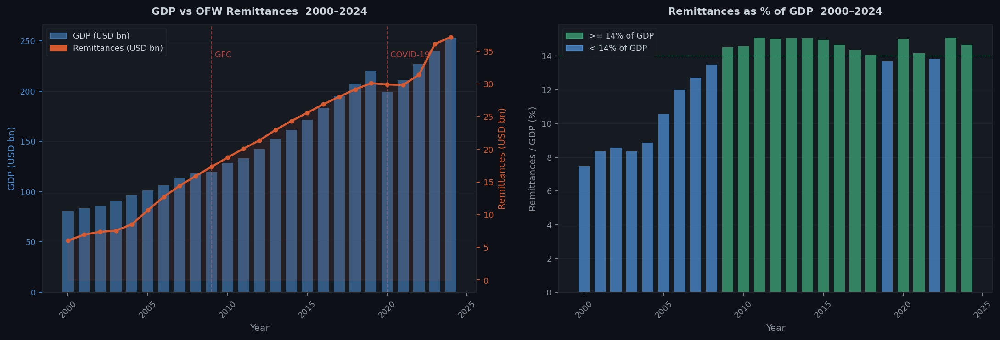

# ph-ofw-analysis

**Philippine Economic Indicators — Exploratory Data Analysis**

A Jupyter notebook and exportable HTML report covering eight analytical sections:
GDP trend decomposition, CPI seasonality, OFW remittance profiling, correlation
analysis, STL time-series decomposition, and a 3-year SARIMAX remittance forecast.

> **Companion data pipeline → [ph-economic-tracker](https://github.com/raldisk/ph-economic-tracker)**
> Ingestion, PostgreSQL warehouse, and dbt transforms that feed this notebook. Run `docker compose up` in that repo and the notebook will connect to live mart data automatically instead of the bundled CSV fallback.

---

## Preview



> Full interactive version → `output/summary_dashboard.html` (open in any browser, no Jupyter needed)

---

## Interactive widgets (Section 9)

The notebook includes four live controls — no cell re-run needed after moving a slider:

| Widget | Controls | What updates |
|---|---|---|
| GDP & Remittances explorer | Year-range slider + highlight dropdown | Dual bar/line chart, bar colors |
| CPI inflation filter | Year-range slider + smoothing dropdown + BSP band toggle | Inflation line chart with MA overlay |
| Correlation heatmap | Variable multi-select + Pearson/Spearman toggle + year range | Live correlation matrix |
| Forecast explorer | Forecast horizon slider + CI level + train cutoff | SARIMAX chart + forecast table |

> **Requires:** JupyterLab or classic Jupyter.
> VS Code notebook view shows widgets as static — open in browser-based Jupyter for full interactivity.

---

## Quickstart

```bash
git clone https://github.com/raldisk/ph-ofw-analysis.git
cd ph-ofw-analysis

python -m venv .venv
source .venv/bin/activate        # Windows: .venv\Scripts\activate
pip install -r requirements.txt

# Optional: connect to ph-economic-tracker PostgreSQL
cp .env.example .env
# Set PH_TRACKER_POSTGRES_DSN in .env

# Generate sample fallback data (needed if not using PostgreSQL)
python scripts/generate_sample_data.py

# Open the notebook
jupyter notebook notebooks/ph_economic_eda.ipynb

# OR: execute and export to HTML in one command
python scripts/export_html.py
# → output/ph_economic_eda.html (no Jupyter needed to view)
```

---

## Analysis sections

| # | Section | Key output |
|---|---|---|
| 1 | Data loading + audit | Shape, nulls, source coverage |
| 2 | GDP EDA | Growth decomposition, CAGR, per-capita trend |
| 3 | CPI + Inflation | BSP compliance rate, Aug-Sep seasonality spike |
| 4 | OFW Remittances | YoY distribution, 3-yr rolling avg, remit/GDP |
| 5 | Correlation analysis | Pearson + Spearman, GDP vs remittances counter-cyclicality |
| 6 | STL decomposition | Trend, seasonal, residual components of CPI |
| 7 | Remittance forecast | SARIMAX(1,1,1), 3-year horizon, holdout RMSE |
| 8 | Key findings | Plain-language conclusions |

---

## Data sources

| Series | Source | Frequency | Years |
|---|---|---|---|
| GDP, remittances, employment | World Bank WDI | Annual | 2000–2024 |
| CPI monthly | PSA OpenSTAT | Monthly | 2000–2024 |
| Remittances % of GDP | World Bank WDI | Annual | 2000–2024 |

**Without PostgreSQL:** bundled CSV files in `data/sample/` provide realistic
synthetic data matching the real series — regenerated via `generate_sample_data.py`.

---

## Project structure

```
ph-ofw-analysis/
├── notebooks/
│   └── ph_economic_eda.ipynb     ← main deliverable
├── data/
│   └── sample/                   ← CSV fallback data
│       ├── gdp_trend.csv
│       ├── cpi_trend.csv
│       ├── remittance_trend.csv
│       └── economic_dashboard.csv
├── scripts/
│   ├── generate_sample_data.py   ← creates realistic synthetic CSVs
│   ├── build_notebook.py         ← regenerates .ipynb from source
│   └── export_html.py            ← executes notebook + exports HTML
├── output/                       ← generated charts + HTML report
├── requirements.txt
└── .env.example
```

---

## Key findings (preview)

- Philippine GDP compounded at **~6% CAGR** from 2000–2024, with two shocks: GFC 2009 and COVID-19 2020.
- Inflation exceeded the BSP 2–4% target band in the majority of months — asymmetrically weighted above the upper bound.
- OFW remittances are **counter-cyclical**: the GDP-remittance growth correlation is not significantly positive, consistent with remittances acting as a macroeconomic shock absorber.
- The **August-September CPI seasonal spike** is the dominant intra-year pattern — driven by rice price dynamics and back-to-school expenditure.
- SARIMAX baseline projects remittances reaching **~$38–40B by 2026**.

---

## License

MIT
